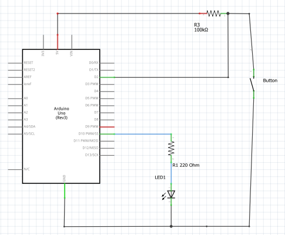
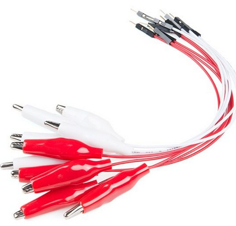

# Module 03 - Programmation des entrées

NOTES:

- Utilisez le tapis de protection pour étaler les pièces nécessaires à chaque montage.
- Débranchez toujours l'alimentation avant de modifier un circuit.

## Exercice 1 - Usage de la console

### Objectif Afficher des valeurs produites par des composants

### Étape 1 : Branchement du circuit

Dans ce exercice, la variable "luminance" sera utilisée pour indiquer la valeur du pulse envoyée à la DEL.

- Effectuez le montage de  l'exercice précédent "Controlle de l'intensité de Dels".

- Modifiez le sketch *VariationMLI.ino* pour activer les affichages à la console. Le sketch doit afficher la valeur de la "luminance" en valeur absolue (sortie de la borne) et en pourcentage correspondant à la "période de cycle" ("duty cycle").

### Questions de réflexion

Avec une croissance régulière de la luminance, pouvez-vous affirmer que l'éclairage croît de façon linéaire? Justifiez votre réponse.

## Exercice 2 - Bouton-poussoir avec sorties numériques

### Objectif Contrôler une DEL sur action du bouton-poussoir

### Étape 1 : Branchement du circuit.

- Effectuez le montage en vous inspirant du schéma suivant.

    Représentation schématique

- Codez le sketch *BoutonPoussoir.ino* qui maintient la DEL allumée lorsque le bouton est enfoncé. La DEL reste éteinte lorsque le bouton est relâché.

- Modifiez le sketch pour éteindre la DEL lorsque le bouton est enfoncé.

- Utilisez la console pour afficher l'état de la DEL à chaque changement d'état. L'affichage doit se présenter sous 2 formes:

1. valeur de l'état: 0 ou 1;
2. texte "DEL allumée"  ou "DEL éteinte"

### Étape 2 : alimentation multiple.

- Sur papier, dessinez un schéma équivalent pour illustrer l'alimentation de 2 DELs en parallèle et alimentées par la *même résistance*.

- Effectuez le montage de votre schéma et la modification du code correspondant.

- Sur papier, dessinez un schéma pour illustrer l'alimentation des 2 DELs en parallèle, mais de façon à ce que chaque DEL soit alimentées par *sa propre résistance*. L'alimentation 5 V est commune.

- Effectuez le montagede votre schéma. Adaptez le codedu sketch pour allumer les 2 DELs en opposition de phase.

L'oeil perçoit-il l'éclairage plus intense ou moins intense avec 2 DELs dans ce cas-là? Pouvez-vous expliquer ce comportement?

### Question de réflexion

L'oeil perçoit-il l'éclairage plus intense ou moins intense avec 2 DELs en parallèle? Pouvez-vous expliquer ce comportement?

## Exercice 2 - bouton poussoir avec Pull-up

Dans ce montage, le bouton poussoir sera alimenté par la borne No 2, la DEL sera alimentée par la borne No 10.

### Étape 1 : montage du circuit

- Effectuez le montage en vous inspirant du schéma suivant.

    Représentation schématique

### Étape 2 : programmation

- Codez le sketch **PullUp.ino* selon le schéma.

- Complétez le schéma en ajoutant une deuxième DEL au circuit. La deuxième DEL doit être branchée sur une borne offrant le LMI.

- modifiez le sketch pour faire allumer les 2 DELs, mais en alternance.

-modifiez le sketch pour que les DELs changent d'intensité de 25 % à chaque fois qu'on appuie sur le bouton. Après 4 appuis successifs, l'intensité doit s'inverser de 25 % et ainsi de suite.

### Question de réflexion

1. Expliquez pourquoi la DEL branchée à la borne 2 ne varie pas d'intensité?

2. Quelle méthode suggérez-vous pour affirmer que l'intensité lumineuse équivaut bien aux pourcentages produits par la LMI?

## Exercice 3 -  bruits parasites

Dans cet exercice, vous utilisez une borne analogique.

- branchez un fil de connexion de 6cm ou plus sur la borne A5 de l'Arduino.

- écrire le sketch *Antenne.ino* pour déclarer la borne A5 comme "borneSensible" et qui affiche l'effet généré par les bruits parasites à la console à toutes les demi-secondes.

-Touchez légèrement l'extrémité de l'"antenne" pendant 3 secondes.

- À partir des valeurs obtenues à la console, expliquez le comportement de la borne A5.

## Exercice 4 - Potentiomètre

### Étape 1 : Montage du circuit

- Effectuez le montage d'un potentiomètre branché de la façon suivante:

    Représentation schématique

- Utilisez des fils "pince alligator" de couleurs différentes pour réaliser les 3 branchements à l'Arduino.

### Étape 2 : Programmation

Pour réaliser ce sketch, vous aurez besoin de la fonction map() d'Arduino.

- Codez le sketch *"*PotentiometreBase.ino* pour implanter la logique suivante:

 La DEL1 est éteinte et la DEL2 s'allume au maximum lorsque le curseur du potentiomètre est en position "1" (minimum).

 En tournant progressivement le curseur vers la position "3" (maximum), la DEL1 s'allume et la DEL2 s'éteint.

- Sur l'écran de la console, affichez les valeurs lues au potentiomètre et les valeurs correspondantes à la borne numérique de DEL1.

### Question de réflexion

1. Quelle est l'intervalle de valeurs produites par une borne analogique?

2. Pouvez-vous affirmer que la résistance variable du potentiomètre suit une courbe linéaire? Justifiez votre réponse.

## Exercice 5 - détecteur infra-rouge

Pour cet exercice, vous avez besoin du détecteur infra-rouge modèle LM35.

