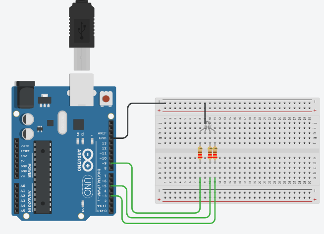
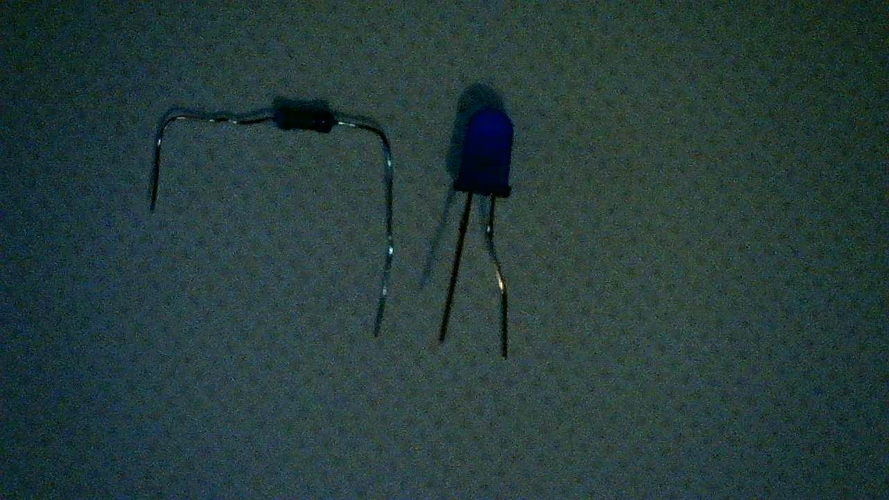

# Module 04 - Langage de programmation pour Arduino

NOTES:

- Les exercices de ce module se réalisent dans le simulation du site TinkerCad
- Si vous les appliquez en physique :
  - Utilisez le tapis de protection pour étaler les pièces nécessaires à chaque montage
  - Débranchez toujours l'alimentation avant de modifier un circuit

## Exercice 1 - Lecture à la console

### Objectif

Sauvegarder des messages venant de la console.

### Étape 1 : Branchement du circuit

Effectuez le montage en vous inspirant du schéma suivant :


### Étape 2 : Programmation

Le but du programme est de lire un message provenant de la console et qui l'enregistre en mémoire. Un maximum de 5 messages doivent être conservés et affichés : **si l'utilisateur envoie un 6 ième message, il est simplement ignoré**.  
(Version optionnelle - levez cette contrainte et retenez simplement les 5 derniers messages. Pour cela inspirez-vous du [buffer circulaire](https://fr.wikipedia.org/wiki/Buffer_circulaire))

Durant la boucle, si aucun texte est disponible à la console, la DEL verte est allumée. Lorsqu'un message est arrivé, la DEL rouge s'allume durant 1 seconde. 

Si le message reçu est "Lire", tous les messages enregistrés sont affichés à l'écran de la console. Les messages sont effacés. 

Sinon, le message s'inscrit dans un tableau de 5 occurrences.

Un temps d'attente de 3 secondes suivra chaque séquence de lecture.

*Version TinkerCad*

- Codez, compilez et corrigez le code au besoin

*Version physique*

- Codez le sketch *LireConsole.ino*
- Compilez et corrigez le code au besoin

## Exercice 2 - Programmation de la classe Flasher

### Objectif Programmer la classe Flasher dans Arduino

### Étape 1 : Branchement du circuit

Effectuez le montage en vous inspirant du schéma suivant :


### Étape 2 : Programmation de la classe Flasher

Le but est de programme la classe "Flasher" vue en cours.

*Version TinkerCad*

- Débutez votre code avec le contenu du fichiers "Flasher.h" et la fin avec le contenu de "Flasher.cpp"
- Compilez et corrigez le code au besoin

*Version physique*

- À l'aide d'un éditeur de texte, composez les fichiers "Flasher.h" et "Flasher.cpp"
- Sauvegardez vos 2 fichiers
- Ouvrez un nouveau sketch Arduino
- Sauvegardez le sous le nom "*MaFabuleuseAnimation.ino*"
- Prenez note du chemin de sauvegarde du sketch
- Déplacez les fichiers "Flasher.h" et "Flasher.cpp" dans le même répertoire que le sketch
- Sur le sketch, cliquez sur le menu Croquis--> Ajouter un fichier...
- Ajoutez le fichier "Flasher.h"
- Cliquez sur le menu Croquis--> Ajouter un fichier...
- Ajoutez le fichier "Flasher.h"
- Compilez et corrigez le code au besoin

### Étape 3 : Tester la classe Flasher

- Testez votre code par quelques appels à la méthode FaireClignoter
- Faites clignoter la DEL rouge 5 fois
- Faites clignoter la DEL verte 8 fois
- Faites vos propres essais

## Exercice 3 - Programmation de la classe RBVDEL

### Objectif Programmer l'affichage d'une DEL RGB

Dans cet exercice, vous allez utiliser les opérateurs de décalage de bits pour afficher diverses couleurs combinées sur la DEL RGB.

### Introduction

La DEL RGB est constituée de 4 broches. Chacune des 3 broches principales alimente une DEL rouge, verte ou bleue intégrées dans l'ampoule. La quatrième broche est reliée au ground. Chaque composante peut prendre une valeur pouvant varier entre 0 et 255 qui représente une teinte de la couleur. La couleur apparente est la combinaison des valeurs injectées aux trois broches principales.

<details>
    <summary>Valeurs des couleurs primaires</summary>

https://www.w3schools.com/colors/colors_picker.asp

</details>

### Étape 1 : Branchement du circuit

- Utilisez TinkecCad pour la simulation.
- Effectuez le montage en vous inspirant du schéma suivant :



### Étape 2 : Programmation

Votre tâche consiste à créer une classe nommée "RVBDEL" et la méthode publique "Afficher" pour que la DEL reproduise diverses couleurs.

Au moment de la création d'une occurrence de la classe, le constructeur fournit les numéros de 3 bornes branchées aux 3 broches qui alimentent la DEL RGB.

La méthode "Afficher" reçoit une valeur de type long en paramètre. **Ce choix est imposé**.

Cette valeur pourra être décomposée en 3 nombres pour déterminer la valeur à donner aux 3 bornes qui produiront une illumination colorée. La méthode doit aussi afficher ces 3 valeurs à la console.

- Avec TinkerCad, voici la structure de votre programme. Complétez le code.

```cpp
// Début -- RVBDEL.h
class RVBDEL {
private:

public:

};
// Fin -- RVBDEL.h

// Début -- RVB.ino
// création d'une instance

void setup()
{

}

void loop()
{
  DemoRVB();
}

void DemoRVB() {
// exemple d'appels

// afficher la couleur PLEINE ROUGE

// afficher la couleur PLEINE BLEU

// afficher la couleur VIOLETTE

}
// Fin -- RBV.ino

// Début -- RVBDEL.cpp
```

## Exercice 4 - Programmation de la classe Affichage8DELs

### Objectif Programmer l'affichage de 8 DELs

Dans cet exercice, vous allez utiliser les opérateurs de décalage de bits pour allumer un ou pluusieus DELs pour reproduire une donnée déclarée en "byte". Chaque bit de la donnée correspond à une DEL.

Utilisez TinkecCad pour la simulation.

### Étape 1 : Branchement du circuit

Effectuez le montage en vous inspirant du schéma suivant.


Astuce pour faciliter le montage le montage physique :

- Pliez une des broches de la résistance légèrement plus longue que l'autre
- Écartez la broche + de la DEL pour l'insérer dans la planchette d'essais

Formes pliées :



### Étape 2 : Programmation

Votre tâche consiste à créer une classe nommée Affichage8DELs et la méthode publique "Afficher" qui prend en paramètre un byte et l'affiche.

Chaque bit du paramètre correspond à la position d'une DEL du montage qui doit être allumée.

Au moment de la création d'une occurrence de la classe, le constructeur reçoit les numéros des 8 bornes branchées aux 8 DELs.

Avec TinkerCad, voici la structure de votre programme. Complétez le code.

```cpp
// Début -- Affichage8DELs.h
class Affichage8DELs {

};
// Fin -- Affichage8DELs.h

// Début -- AllumerDELs.ino
// création d'une instance

void setup()
{
  ;
}

void loop()
{
  // exemples de tests

  //Compter();  // compte de 0 à 255
  
  //GaucheDroite(); // affiche une seule DEL de droite a gauche et vice-versa
}  
// Fin -- AllumerDELs.ino

// Debut de  Affichage8DELs.cpp

// fin de Affichage8DELs.cpp
```

<details>
<summary>Indice</summary>

Inspirez vous de l'exemple du cours sur le codage d'une couleur RVB dans un entier. Ici, vous n'avez pas à traiter les informations par 8 bits, mais bit par bit. Le décalage et le masque seront donc relatifs à 1 bit au lieu des 8 du cours.

</details>

## Exercice 5 - Programmation optionnelle de la classe Affichage8DELs

À la place de prendre 8 DELs comme dans l'exercice précédent, vous devez fournir 7 constructeurs ayant de 1 à 8 paramètres qui représentent un numéro de borne. Si le programmeur utilise le constructeur à deux paramètres, il ne pourra allumer que deux DELs.

### Programmation

Codez la classe et testez la.
